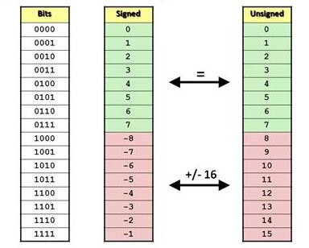

# ADDER

## Half ADDER
### Truth table
| Input A | Input B | Carry (C) | Sum (S) |
| :---: | :---: | :---: | :---: |
| 0 | 0 | 0 | 0 |
| 0 | 1 | 0 | 1 |
| 1 | 0 | 0 | 1 |
| 1 | 1 | 1 | 0 |
## Full ADDER
### Truth table
| Input A | Input B | Carry In ($C_{in}$) | Carry Out ($C_{out}$) | Sum (S) |
| :---: | :---: | :---: | :---: | :---: |
| 0 | 0 | 0 | 0 | 0 |
| 0 | 0 | 1 | 0 | 1 |
| 0 | 1 | 0 | 0 | 1 |
| 0 | 1 | 1 | 1 | 0 |
| 1 | 0 | 0 | 0 | 1 |
| 1 | 0 | 1 | 1 | 0 |
| 1 | 1 | 0 | 1 | 0 |
| 1 | 1 | 1 | 1 | 1 |
## Ripple carry adder

## Carry look ahead adder

## Number representation  

## UNSIGNED ADDER & SIGNED ADDER

