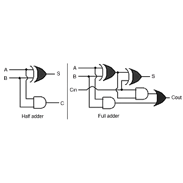
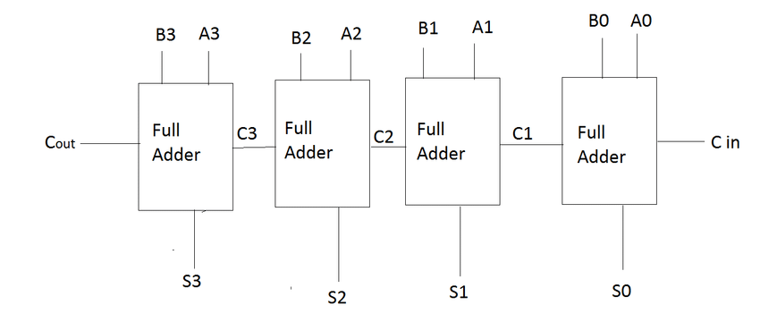
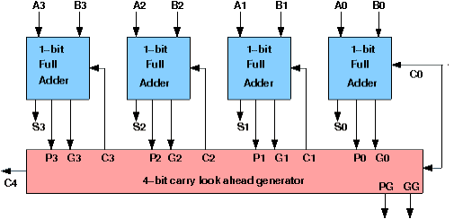
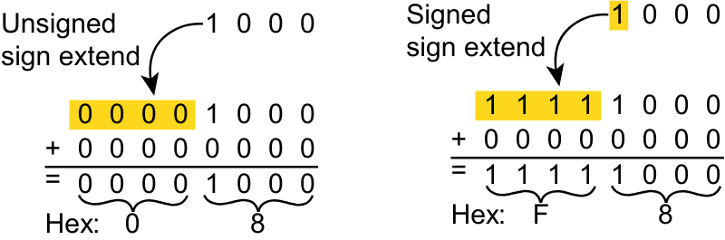

# ADDER

## Half ADDER
### Truth table
    <table border="1" cellpadding="8" cellspacing="0" style="border-collapse: collapse; width: 100%; text-align: left; border-color: #ddd;">
        <thead>
            <tr style="background-color: #f2f2f2;">
                <th colspan="2">Input</th>
                <th colspan="2">Output</th>
            </tr>
        </thead>
        <tbody>
            <tr style="background-color: #f2f2f2;">
                
                <td>A</td>
                <td>B</td>
                <td>SUM</td>
                <td>Carry</td>
            </tr>
            <tr>
                <td>0</td>
                <td>0</td>
                <td>0</td>
                <td>0</td>
            </tr>
            <tr>
                <td>0</td>
                <td>1</td>
                <td>1</td>
                <td>0</td>
            </tr>
              <tr>
                <td>1</td>
                <td>0</td>
                <td>1</td>
                <td>0</td>
            </tr>
               <tr>
                <td>1</td>
                <td>1</td>
                <td>0</td>
                <td>1</td>
            </tr>
        </tbody>
    </table>
## Full ADDER
### Truth table
    <table border="1" cellpadding="8" cellspacing="0" style="border-collapse: collapse; width: 100%; text-align: left; border-color: #ddd;">
        <thead>
            <tr style="background-color: #f2f2f2;">
                <th colspan="3">Input</th>
                <th colspan="2">Output</th>
            </tr>
        </thead>
        <tbody>
            <tr style="background-color: #f2f2f2;">
                
                <td>A</td>
                <td>B</td>
                <td>Cin</td>
                <td>SUM</td>
                <td>Carry</td>
            </tr>
            <tr>
                <td>0</td>
                <td>0</td>
                <td>0</td>
                <td>0</td>
                <td>0</td>
            </tr>
            <tr>
                <td>0</td>
                <td>0</td>
                <td>1</td>
                <td>1</td>
                <td>0</td>
            </tr>
              <tr>
                <td>0</td>
                <td>1</td>
                <td>0</td>
                <td>1</td>
                <td>0</td>
            </tr>
               <tr>
                <td>0</td>
                <td>1</td>
                <td>1</td>
                <td>0</td>
                <td>1</td>
            </tr>
            <tr>
                <td>1</td>
                <td>0</td>
                <td>0</td>
                <td>1</td>
                <td>0</td>
            </tr>
            <tr>
                <td>1</td>
                <td>0</td>
                <td>1</td>
                <td>0</td>
                <td>1</td>
            </tr>
              <tr>
                <td>1</td>
                <td>1</td>
                <td>0</td>
                <td>0</td>
                <td>1</td>
            </tr>
               <tr>
                <td>1</td>
                <td>1</td>
                <td>1</td>
                <td>1</td>
                <td>1</td>
            </tr>
        </tbody>
    </table>
## Ripple carry adder

## Carry look ahead adder

## Number representation  

## UNSIGNED ADDER & SIGNED ADDER

