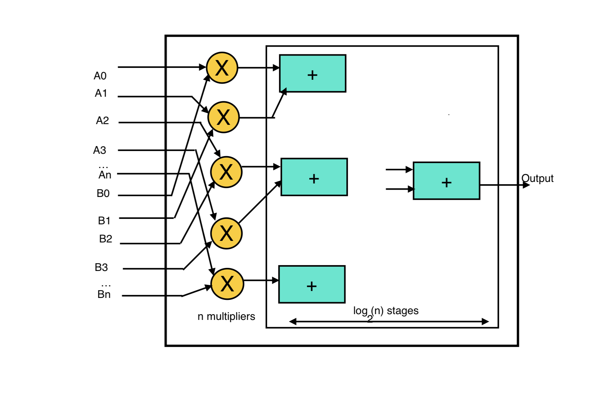

<h1> MAC - Multiply-Accumulate operation</h1>
A MAC unit performs two arithmetic operations in a single clock cycle: it multiplies two numbers and adds the result to a running total (an accumulator).
Mathematically, it computes:

Multiplier: Takes inputs A and B and multiplies them.
Adder: Adds the product to the current value stored in the register.
Accumulator Register: A flip-flop or register that holds the running total and updates every clock cycle.

# Multiply-Accumulate (MAC) Operations in CNNs

In a Convolutional Neural Network (CNN), **MAC stands for Multiply-Accumulate operation**. 

It represents the fundamental mathematical action of **multiplying two numbers and adding the result to an accumulator**. Because convolution layers rely entirely on dot products (multiplying weights by inputs and summing them up), MAC count is the primary metric used to measure a CNN's computational complexity, hardware requirements, and power consumption.

---

##  What a Single MAC Looks Like
One MAC operation computes the following formula in a single clock cycle or step:

$$\text{Accumulator} = \text{Accumulator} + (A \times B)$$

* **In a CNN**: $A$ is the feature map input pixel, and $B$ is the kernel/filter weight.
* **MAC vs. FLOP**: One MAC operation consists of **two** Floating Point Operations (FLOPs)—one multiplication and one addition. Therefore, $\text{FLOPs} \approx 2 \times \text{MACs}$.

---

##  How to Calculate MACs in a Convolutional Layer
To find the total MACs for a standard convolutional layer, you multiply the total number of operations required to generate a single output element by the total number of elements in the output feature map.

### The Formula:
$$\text{Total MACs} = K_H \times K_W \times C_{in} \times H_{out} \times W_{out} \times C_{out}$$

### Variable Definitions:
* $K_H, K_W$: Height and width of the kernel (filter)
* $C_{in}$: Number of input channels
* $H_{out}, W_{out}$: Height and width of the resulting output feature map
* $C_{out}$: Number of output channels (number of filters)

---

##  Concrete Calculation Example
Let's calculate the MACs for a typical CNN layer:
* **Input**: $32 \times 32$ image with **3 channels** (RGB)
* **Filter size**: $3 \times 3$ kernel, with **16 output channels**
* **Output size**: Assume $\text{stride}=1$ and $\text{padding}=0$, resulting in a **$30 \times 30$** output map.

$$\text{MACs} = 3 \times 3 \times 3 \times 30 \times 30 \times 16$$
$$\text{MACs} = 27 \times 900 \times 16 = \mathbf{388,800\text{ operations}}$$

---

##  Why MAC Counts Matter
* **Hardware Efficiency**: Hardware accelerators like GPUs, TPUs, and Edge AI chips (NPUs) are heavily built around "MAC arrays" or systolic arrays designed to execute these operations in parallel.
* **Battery & Power Constraints**: Running mobile models (like MobileNet) requires minimizing MACs to prevent draining smartphone or IoT batteries. 
* **Latency**: Lower MAC counts directly translate to faster inference times.

