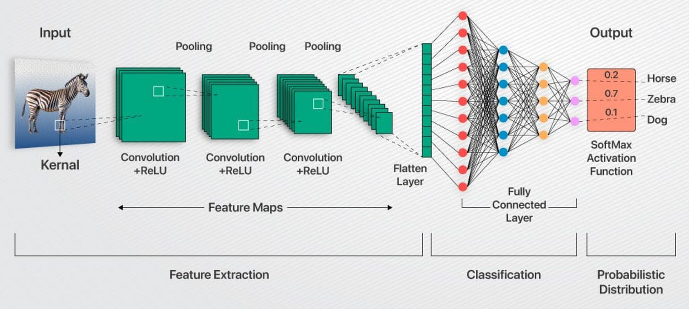
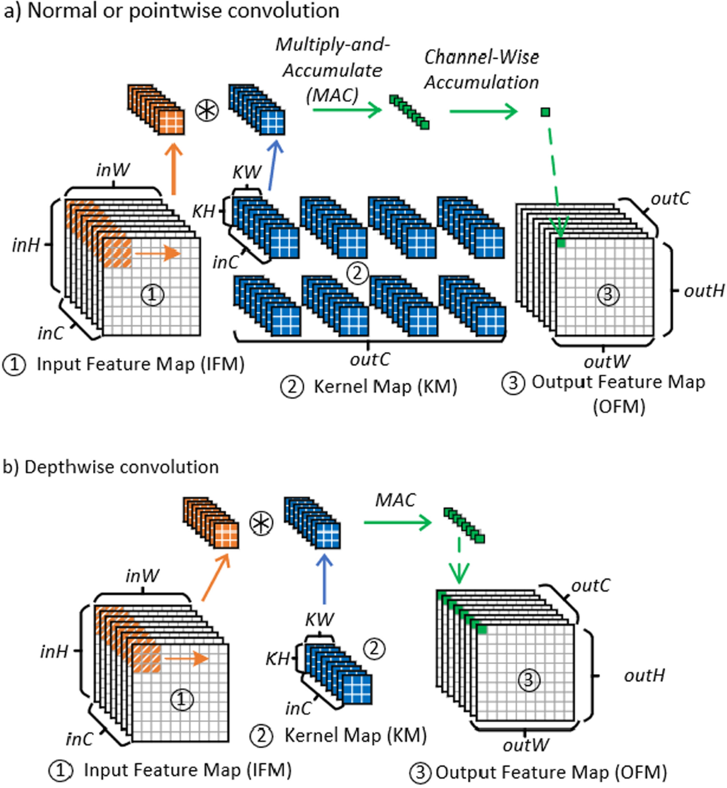

<h1> Implementation of CNN(Convolutional Neural Network) </h1>

A CNN relies heavily on matrix multiplication and convolutions.To process an image, a CNN must multiply incoming data inputs (X) by static weight values (W) and sum them up.Therefore, a CNN hardware accelerator is essentially a massive, parallel grid of hundreds or thousands of these MAC units working together simultaneously.

<h2> AI is Just Massive Matrix Multiplication </h2>
At a mathematical level, AI models (like ChatGPT, Stable Diffusion, or CNNs) do not "think." They perform billions of dot products and matrix multiplications.
To calculate a single output neuron, the chip must multiply dozens of inputs by dozens of trained "weights" and add them all together.
Because a MAC unit multiplies and accumulates in a single step, it is perfectly optimized for this exact math.

<h2>The Core of Convolutional Layers (CNNs)</h2>
In image-processing AI (CNNs), a small matrix called a "kernel" slides across an image to detect edges, shapes, and objects. At every single pixel, the hardware performs a Multiply-Accumulate operation.3. Pipelining for Extreme SpeedIn your SystemVerilog RTL design, MAC units are arranged in grids called Systolic Arrays or Vector Processing Units.Data flows through these arrays like water through pipes.One MAC unit passes its result directly to the next one, allowing the AI chip to compute trillions of operations per second (TOPS) while saving massive amounts of power.

A MAC unit performs two arithmetic operations in a single clock cycle: it multiplies two numbers and adds the result to a running total (an accumulator).
Mathematically, it computes:

Multiplier: Takes inputs A and B and multiplies them.
Adder: Adds the product to the current value stored in the register.
Accumulator Register: A flip-flop or register that holds the running total and updates every clock cycle.

<h2>Kernal</h2>
<section class="cnn-calculation">
    <h3>1. Total Unique Positions (Standard Output Size)</h3>
    
In deep learning, this is equivalent to calculating the spatial dimensions of the output feature map.

    
The general formula for the number of positions along a single dimension is:

    

        Positions = (L - K + 2P) / S + 1 
    

    
Where:

    <ul>
        <li><strong>L</strong> = Input dimension (<em>H</em> or <em>W</em>)</li>
        <li><strong>K</strong> = Kernel size (<em>3</em>)</li>
        <li><strong>P</strong> = Padding (<em>0</em>)</li>
        <li><strong>S</strong> = Stride (<em>1</em>)</li>
    </ul>
    
Substituting your values (<em>K=3, P=0, S=1</em>):

    <ul>
        <li><strong>Horizontal positions (OW):</strong> (W - 3 + 0) / 1 + 1 = <strong>W - 2</strong></li>
        <li><strong>Vertical positions (OH):</strong> (H - 3 + 0) / 1 + 1 = <strong>H - 2</strong></li>
    </ul>
    
<strong>Total Unique Windows / Placements:</strong>

    

        Total Positions = (H - 2) &times; (W - 2)
    

</section>

<section class="cnn-shifts">
    <h3>2. Literal Number of Shift Movements</h3>
    
If the question is asking for the exact number of times the filter actively slides/shifts from its starting position:

    
A filter starts at the top-left corner (Position 1). To cover a row of <em>OW</em> positions, it must shift to the right exactly <em>OW - 1</em> times.

    <ul>
        <li><strong>Horizontal shifts per row:</strong> (W - 2) - 1 = <strong>W - 3</strong></li>
        <li><strong>Vertical shifts per column:</strong> (H - 2) - 1 = <strong>H - 3</strong></li>
    </ul>
</section>

<section class="cnn-summary-table" style="margin-top: 25px;">
    <h3>Summary Table (For <em>H &times; W</em> image, 3 &times; 3 kernel, Stride 1, No Padding)</h3>
    <table border="1" cellpadding="8" cellspacing="0" style="border-collapse: collapse; width: 100%; text-align: left; border-color: #ddd;">
        <thead>
            <tr style="background-color: #f2f2f2;">
                <th>Interpretation</th>
                <th>Dimension</th>
                <th>Equation</th>
            </tr>
        </thead>
        <tbody>
            <tr>
                <td rowspan="3"><strong>Total Filter Placements (Output Size)</strong></td>
                <td>Total</td>
                <td><strong>(H - 2) &times; (W - 2)</strong></td>
            </tr>
            <tr>
                <td>Per Row</td>
                <td>W - 2</td>
            </tr>
            <tr>
                <td>Per Column</td>
                <td>H - 2</td>
            </tr>
            <tr>
                <td rowspan="2"><strong>Literal Number of Shifts (Movements)</strong></td>
                <td>Per Row</td>
                <td><strong>W - 3</strong></td>
            </tr>
            <tr>
                <td>Per Column</td>
                <td><strong>H - 3</strong></td>
            </tr>
        </tbody>
    </table>
</section>

<h2>Implemented items so far:</h2>
<ol>
<li>Initial parallel/sequential MAC</li>
<li>Adder</li>
<li>RAM</li>
</ol>

<h2>Status</h2>
Ongoing

