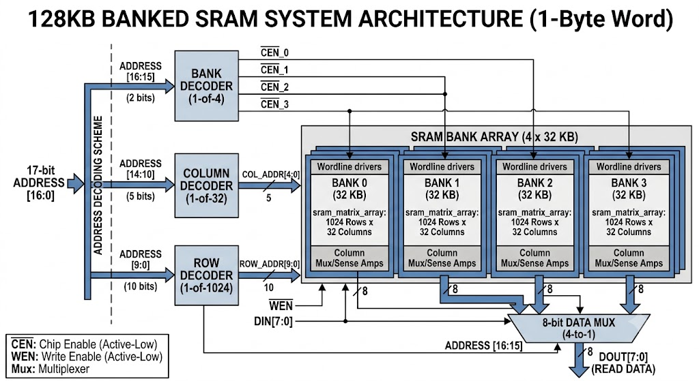
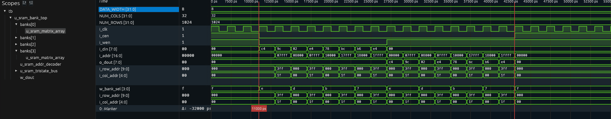

## Architectural Block Diagram

The hierarchical organization and address decoding flow are visualized below.



---

## Technical Specifications

### Total System Capacity
- **Total Storage**: 128 KB ($131,072$ bytes / words).
- **Organization**: Four independent 32 KB banks.
- **Word Width**: 1 Byte (8 bits).
- **Address Space**: 17 bits (`i_addr[16:0]`).

### Bank Configuration (32 KB Matrix)
Each of the four parallel banks is physically structured with a high column multiplexing ratio:
- **Internal Structure**: **1,024 Rows** $\times$ **32 Columns**.
- **Words per Bank**: $32,768$ words (bytes).

---

## Address Mapping & Decoding Scheme

The system implements the following 17-bit address decoding logic to access the correct byte within the matrix grid.

| Address Slice | Bit Width | Function | Description |
| :--- | :---: | :--- | :--- |
| `i_addr[16:15]` | 2 bits | **Bank Select** | Decodes `1-of-4` active-low Chip Enables (`CEN_0` to `CEN_3`) to activate the target bank. Also drives the final output data multiplexer. |
| `i_addr[14:10]` | 5 bits | **Column Address** | Bitline Mux index selecting 1 of 32 parallel column words ($2^5 = 32$). |
| `i_addr[9:0]` | 10 bits | **Row Address** | Wordline index selecting 1 of 1,024 physical rows inside the active bank ($2^{10} = 1024$). |

---

## Signal Interface Definitions

| Pin Name | Direction | Bit Width | Type | Active State | Description |
| :--- | :--- | :--- | :--- | :---: | :--- |
| `i_clk` | Input | 1 | `logic` | Rising Edge | Primary system clock. |
| `i_cen` | Input | 1 | `logic` | Low (`0`) | Global Chip Enable. When High, all banks enter low-power idle. |
| `i_wen` | Input | 1 | `logic` | Low (`0`) | Global Write Enable (`0` = Write Mode, `1` = Read Mode). |
| `i_addr` | Input | 17 | `logic` | High (`1`) | System word address bus (`[16:0]`). |
| `i_din` | Input | 8 | `logic` | High (`1`) | Byte write data bus (`[7:0]`). |
| `o_dout` | Output | 8 | `logic` | High (`1`) | Registered byte read data output bus (`[7:0]`). |

# Simulation


## File List

```text
filelist.f
sram_matrix_array.sv
sram_tristate_bus.sv
sram_addr_decoder.sv
sram_bank_top.sv
