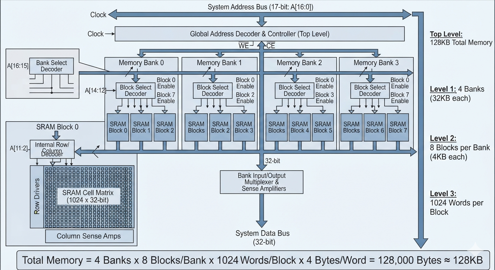

# 128KB Hierarchical Banked SRAM Implementation

This repository contains the architecture, decoding mapping, and structural layout for a **128 KB SRAM** configured with 4 banks, each containing 8 blocks of 1024 words.

---

## 🗺️ Memory Address Decoding Breakdown

For a 128 KB memory space, a **17-bit memory address** ($2^{17} = 131,072 	ext{ bytes}$) is required. Assuming a standard 32-bit word-aligned architecture, the address bits are mapped as follows:

| Address Bits | Field Name | Width | Description |
| :--- | :--- | :--- | :--- |
| **A[16:15]** | **Bank Select** | 2 bits | Decodes $2^2 = 4$ memory banks using a 2-to-4 decoder. |
| **A[14:12]** | **Block Select** | 3 bits | Decodes $2^3 = 8$ blocks per bank using a 3-to-8 decoder. |
| **A[11:2]** | **Internal Word Address** | 10 bits | Points to one of the $2^{10} = 1024$ words inside the targeted block. |
| **A[1:0]** | **Byte Offset** | 2 bits | Selects individual bytes within the 32-bit word (Ignored if strictly word-aligned). |

### Mathematical Alignment
$$\text{4 banks} \times \text{8 blocks/bank} \times \text{1024 words/block} \times \text{4 bytes/word} = 128\text{ KB}$$

---

## 🏗️ Hierarchical Block Diagram

The system architecture is structured to route data hierarchically: the top-level address lines determine the active memory bank, which subsequently drives block selection to activate a specific matrix array without causing heavy dynamic power draw across unselected blocks.

---

## 🔧 Key Implementation Guidelines

* **Bank and Block Decoding**: Use low-skew combinatorial decoders for the **Bank Select** and **Block Select** lines. Enabling only one specific block in one specific bank during an active cycle significantly minimizes dynamic power consumption.
* **SRAM Cell Core**: Each of the 32 total blocks ($4 	imes 8$) houses an array of **6T SRAM cells** configured as a $1024 	imes 32$ bit matrix (or optimized into a squarer $128 	imes 256$ layout to balance vertical and horizontal wire lengths).
* **Periphery Circuitry**: Each block requires its own set of pre-charge circuits, row decoders, **sense amplifiers** to accelerate read operations, and write drivers to override the cross-coupled inverters.
