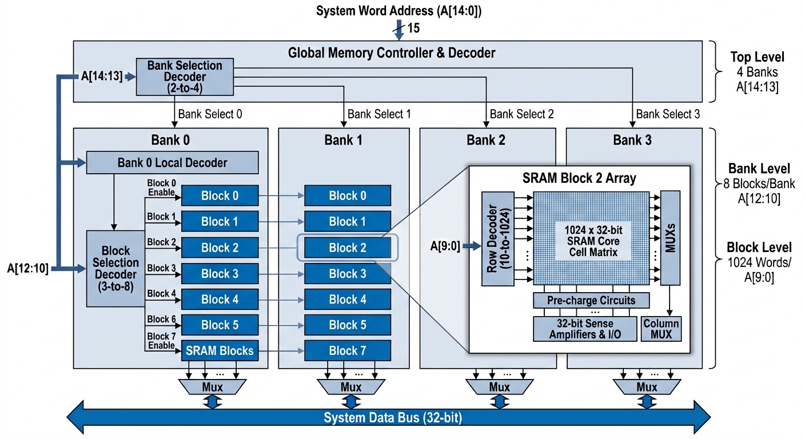

# SRAM Overview

The acronym **SRAM** primarily refers to two entirely different industries: **Static Random-Access Memory** in computer electronics, and **SRAM Corporation**, a premier global manufacturer of bicycle components.

---

### Static Random-Access Memory (Electronics)

In technology, **SRAM** is a type of volatile semiconductor memory that uses flip-flop latching circuitry to store each bit of data. Unlike Dynamic RAM (DRAM), SRAM **retains data without needing constant electrical refreshing**, making it significantly faster but more expensive and less dense.

* **Core Architecture**: Typically built using a **6-Transistor (6T) CMOS cell** arrangement.
* **Primary Use**: Serving as high-speed **CPU Cache (L1, L2, L3)**, microprocessor registers, and embedded systems where low latency is critical.
* **Types**: Includes *Asynchronous SRAM*, *Synchronous SRAM* (clocks data transfer), and *Non-volatile SRAM (nvSRAM)* which uses battery backups to prevent data loss.


## 128KB Hierarchical Banked SRAM Implementation

This repository contains the architecture, decoding mapping, and structural layout for a **128 KB SRAM** configured with 4 banks, each containing 8 blocks of 1024 words.

---

###  Memory Address Decoding Breakdown

For a 128 KB memory space, a **17-bit memory address** ($2^{17} = 131,072 	ext{ bytes}$) is required. Assuming a standard 32-bit word-aligned architecture, the address bits are mapped as follows:

| Address Bits | Field Name | Width | Description |
| :--- | :--- | :--- | :--- |
| **A[14:13]** | **Bank Select** | 2 bits | Decodes $2^2 = 4$ memory banks using a 2-to-4 decoder. |
| **A[12:10]** | **Block Select** | 3 bits | Decodes $2^3 = 8$ blocks per bank using a 3-to-8 decoder. |
| **A[9:0]** | **Internal Word Address** | 10 bits | Points to one of the $2^{10} = 1024$ words inside the targeted block. |

#### Mathematical Alignment
$$\text{4 banks} \times \text{8 blocks/bank} \times \text{1024 words/block} \times \text{4 bytes/word} = 128\text{ KB}$$

---

###  Hierarchical Block Diagram

The system architecture is structured to route data hierarchically: the top-level address lines determine the active memory bank, which subsequently drives block selection to activate a specific matrix array without causing heavy dynamic power draw across unselected blocks.




#### With Byte offset


---


## SRAM Interface 


```text
                       ┌──────────────────────────────┐
                       │      128KB Banked SRAM       │
                       │    (Word-Addressable Core)   │
                       │                              │
   CLK ───────────────►│ clk                          │
   CE_B (Enable) ─────►│ ce_b                         │
   WE_B (Read/Write) ─►│ we_b             dout [31:0] ├────────► DOUT [31:0]
                       │                              │  (Read Data Out)
   ADDR [14:0] ───────►│ addr [14:0]                  │
(15-bit Word Addr)     │                              │
                       │                  din [31:0]  │◄──────── DIN [31:0]
                       │                              │ (Write Data In)
                       └──────────────────────────────┘
```

## Bank Selection Decoder Interface Logic

The layout below represents the combinatorial 2-to-4 decoding gating circuit. It isolates the most significant bits of the address bus to power-gate individual memory banks during memory access cycles.

```text
                    ┌─────────────────────────┐
ADDR[14] ──────────►│                         ├─► BANK_SEL[0] (To Bank 0 Enable)
ADDR[13] ──────────►│  2-to-4 Decoder Core    ├─► BANK_SEL[1] (To Bank 1 Enable)
                    │  With Active-High Enable│─► BANK_SEL[2] (To Bank 2 Enable)
CE_B ──►[ Inverter ]►│                         ├─► BANK_SEL[3] (To Bank 3 Enable)
                    └─────────────────────────┘
```

###  Key Implementation Guidelines

* **Bank and Block Decoding**: Use low-skew combinatorial decoders for the **Bank Select** and **Block Select** lines. Enabling only one specific block in one specific bank during an active cycle significantly minimizes dynamic power consumption.
* **SRAM Cell Core**: Each of the 32 total blocks ($4 \times 8$) houses an array of **6T SRAM cells** configured as a $1024 \times 32$ bit matrix (or optimized into a squarer $128 \times 256$ layout to balance vertical and horizontal wire lengths).
* **Periphery Circuitry**: Each block requires its own set of pre-charge circuits, row decoders, **sense amplifiers** to accelerate read operations, and write drivers to override the cross-coupled inverters.
