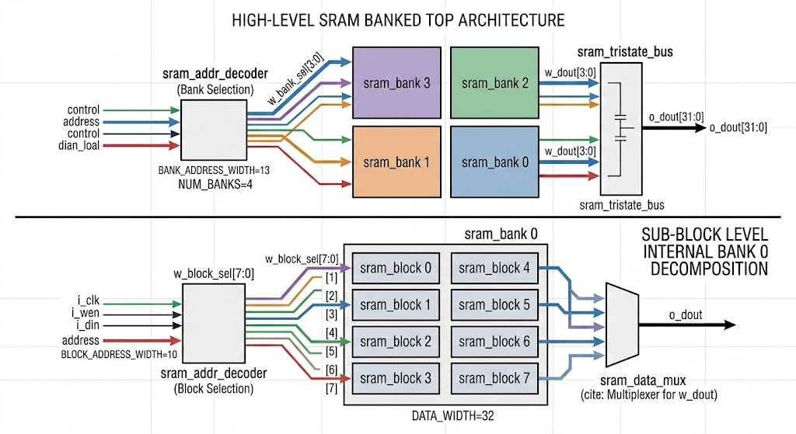

# SRAM Architecture diagram 



# Banked SRAM Memory Controller Architecture

This repository contains a modular, parameterized, and pipelined SRAM memory controller written in SystemVerilog. The design uses a two-tier banked architecture (`sram_banked_top` -> `sram_bank` -> `sram_block`) with active-low chip enables, registered address decoding, data multiplexing, and tri-state bus driving.

---

## High-Level Architecture (`sram_banked_top`)

The top-level wrapper orchestrates memory access across multiple SRAM banks using active-low bank decoding and tri-state output bus driving[cite: 18, 21].

* **Parameters**:
  * `DATA_WIDTH` (Default: `32`) – Width of data buses (`i_din`, `o_dout`)[cite: 18].
  * `ADDRESS_WIDTH` (Default: `15`) – Total system address width[cite: 18].
  * `NUM_BANKS` (Default: `4`) – Total number of instantiated memory banks[cite: 18].
  * `NUM_BLOCKS` (Default: `8`) – Number of memory blocks per bank[cite: 18].
* **Address Allocation**:
  * `BANK_ADDRESS_WIDTH` = `13` bits (`ADDRESS_WIDTH - $clog2(NUM_BANKS)`) – Routed to each bank[cite: 18].
  * `BANK_SEL_ADDRESS_WIDTH` = `2` bits (`$clog2(NUM_BANKS)`) – Upper address bits `i_addr[14:13]` used for bank decoding[cite: 18].
* **Functionality**:
  * Broadcasts `i_clk`, `i_wen`, `i_din`, and lower address bits `i_addr[12:0]` to all four banks[cite: 18].
  * Generates active-low bank select signals (`w_bank_sel[3:0]`) using `sram_addr_decoder`[cite: 16, 18].
  * Multiplexes read data from banks using `sram_tristate_bus`, driven by the 1-cycle delayed select vector `w_bank_sel_dly[3:0]` to match read pipeline latency[cite: 16, 18, 21].

---

## Bank Sub-Module (`sram_bank`)

The intermediate hierarchy level manages local block array selection, local address decoding, and output multiplexing[cite: 17].

* **Address Slicing**:
  * `BLOCK_ADDRESS_WIDTH` = `10` bits (`BANK_ADDRESS_WIDTH - $clog2(NUM_BLOCKS)`) – Block depth address[cite: 17].
  * `BLOCK_SEL_ADDRESS_WIDTH` = `3` bits (`$clog2(NUM_BLOCKS)`) – Address bits `i_addr[12:10]` used to select active blocks[cite: 17].
* **Functionality**:
  * Decodes sub-address bits `i_addr[12:10]` into active-low block enable signals (`w_block_sel[7:0]`) and delayed signals (`w_block_sel_dly[7:0]`) via `sram_addr_decoder`[cite: 16, 17].
  * Operates only the targeted `sram_block` (`i_cen = 0`) during access, minimizing dynamic power consumption[cite: 17, 19].
  * Selects read data (`w_dout[7:0]`) via `sram_data_mux` using `w_block_sel_dly[7:0]`[cite: 17, 20].

---

## Module Breakdown

### 1. `sram_addr_decoder`
A parameterized active-low address decoder with registered pipeline delay outputs[cite: 16].
* **Inputs**: `i_clk`, `i_cen`, `i_addr[SEL_ADDRESS_WIDTH-1:0]`[cite: 16].
* **Outputs**: `o_sel` (active-low combinational enable) and `o_sel_dly` (1-clock-cycle registered enable)[cite: 16].
* **Behavior**: Pulls `o_sel[i_addr]` low when `!i_cen`[cite: 16]. Registers `o_sel` into `o_sel_dly` on `posedge i_clk`[cite: 16].

### 2. `sram_block`
The memory cell primitive storing $2^{\text{BLOCK\_ADDRESS\_WIDTH}}$ words[cite: 19].
* **Operations**: Synchronous active-low write (`!i_cen && !i_wen`) and read (`!i_cen`) operations on `posedge i_clk`[cite: 19].

### 3. `sram_data_mux`
An 8-to-1 data multiplexer inside each bank[cite: 17, 20].
* **Behavior**: Scans `i_sel` (connected to `w_block_sel_dly`) and routes the selected 32-bit block output array word to `o_data`[cite: 17, 20].

### 4. `sram_tristate_bus`
Tri-state output driver for the top-level output bus[cite: 18, 21].
* **Behavior**: Drives `i_data[i]` to `o_bus_output` when `!i_enable[i]`[cite: 21]. Drives high-impedance (`'bz`) on disabled channels[cite: 21].

---

## File List

```text
filelist.f
├── sram_addr_decoder.sv
├── sram_block.sv
├── sram_data_mux.sv
├── sram_bank.sv
├── sram_tristate_bus.sv
└── sram_banked_top.sv
